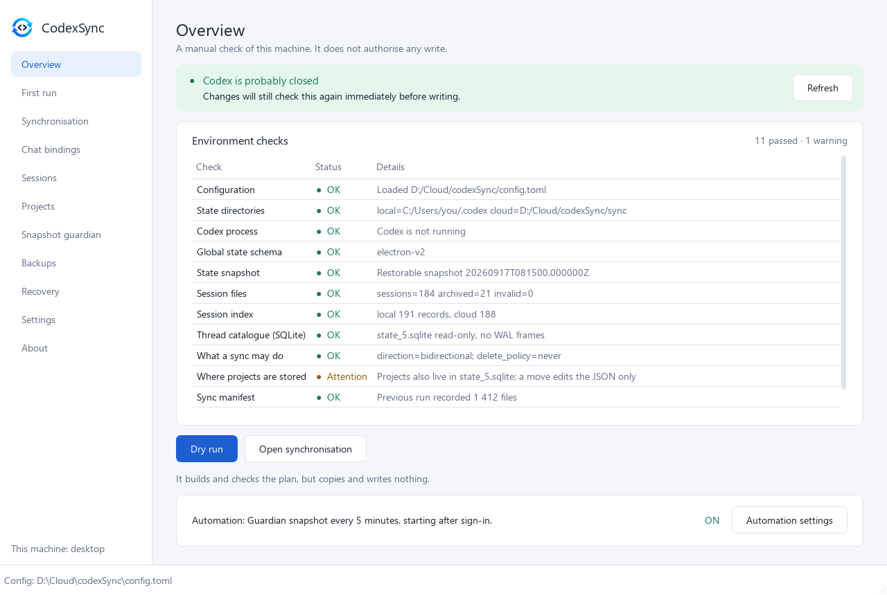

<p align="center">
  
</p>

<h1 align="center">codexSync</h1>

<p align="center">
  Carry your local Codex state — projects, chat bindings and session history —
  between personal machines through a cloud-synced folder.
</p>

<p align="center">
  <a href="https://github.com/kroxiksut/codexSync/actions/workflows/ci.yml"></a>
  <a href="https://github.com/kroxiksut/codexSync/releases"></a>
  
  
  
  
  <a href="./LICENSE"></a>
</p>

<p align="center">
  <b>English</b> · <a href="./README.ru.md">Русский</a> · <a href="./README.zh.md">中文</a>
</p>

> [!IMPORTANT]
> Validated in practice Windows → Windows only. macOS is supported in code and
> CI, but an end-to-end handoff on real macOS machines has not been validated.

<p align="center">
  <a href="docs/en/GUI.md"></a>
</p>

## What it does

- **Syncs** the Codex state directory through any cloud folder — backup first,
  and only while Codex is closed. → [Synchronisation](docs/en/SYNC.md)
- **Guards the global state** with verified snapshots taken *while Codex runs*,
  written only outside `.codex`. → [Guardian](docs/en/GUARDIAN.md)
- **Moves session history between machines**, classifying every branch; a
  divergence is never merged or decided by timestamp.
  → [Sessions](docs/en/SESSIONS.md)
- **Finds a chat and puts it under a project**, repairs bindings after a machine
  handoff, moves a project's files. → [Projects and chats](docs/en/PROJECTS.md)
- **Recovers from an interrupted write** — lock, journal, verified backup.
  → [Backups and recovery](docs/en/RECOVERY.md)

Neither an integration with Codex internals nor a real-time sync:
[what it does not do](docs/en/README.md#what-it-does-not-do).

## Install

```powershell
pip install ".[gui]"     # command line and the window; `pip install .` for the CLI only
codexsync-gui            # or: codexsync -c config.toml doctor
```

Windows builds without Python are in
[Releases](https://github.com/kroxiksut/codexSync/releases). Full instructions
and the first run: [installing and getting started](docs/en/README.md#install).

## Documentation

| | |
|---|---|
| [Overview](docs/en/README.md) | How it works, install, first run, design principles, platforms |
| [The window](docs/en/GUI.md) | All eleven screens with screenshots |
| [Command line](docs/en/CLI.md) | Every command, global options, exit codes |
| [Configuration](docs/en/CONFIGURATION.md) | `config.toml` section by section, automation |
| [Synchronisation](docs/en/SYNC.md) | `plan` and `sync`: comparison, conflicts, direction, deletions |
| [Guardian](docs/en/GUARDIAN.md) | Snapshots of the global state, quarantine, restore, a new baseline |
| [Sessions](docs/en/SESSIONS.md) | Session branches across machines, working set, mirror, index |
| [Projects and chats](docs/en/PROJECTS.md) | Chat bindings, repair after a handoff, moving a project |
| [Backups and recovery](docs/en/RECOVERY.md) | Backups, restore, interrupted mutations |

Every page in one place: [docs/](docs/README.md). For contributors:
[developer documents](docs/dev/README.md). Release notes:
[CHANGELOG.md](./CHANGELOG.md).

## Status

0.2 — the first release with the window (`codexsync[gui]` or `CodexSync.exe`)
next to the command line. A few runtime behaviours are deliberately left unused
until a controlled experiment records them — see
[what is not proven yet](docs/en/README.md#what-is-not-proven-yet).

## License

Dual-licensed: open source under `GPL-3.0-or-later` ([LICENSE](./LICENSE)), with
a commercial path described in [COMMERCIAL_LICENSE.md](./COMMERCIAL_LICENSE.md).
Contributions are accepted under [CONTRIBUTING.md](./CONTRIBUTING.md) and
[CLA.md](./CLA.md).
