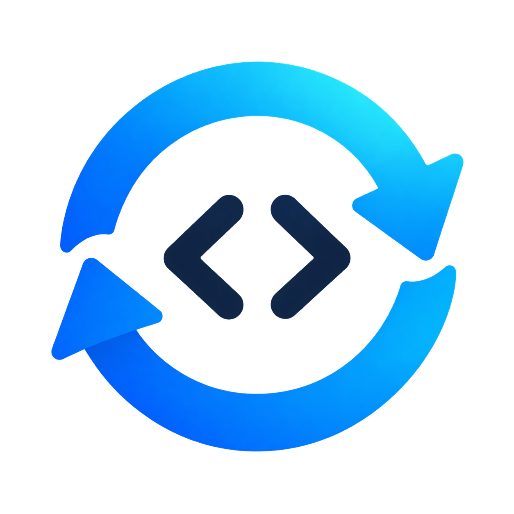

<p align="center">
  
</p>

<h1 align="center">codexSync</h1>

<p align="center">
  Безопасно переносит вашу работу в Codex между личными машинами — чаты,
  проекты, настройки и локальное состояние — с защищённой передачей, решением
  конфликтов, проверенными резервными копиями и восстановлением.
</p>

<p align="center">
  <a href="https://github.com/kroxiksut/codexSync/actions/workflows/ci.yml"></a>
  <a href="https://github.com/kroxiksut/codexSync/releases"></a>
  
  
  
  
  <a href="./LICENSE"></a>
</p>

<p align="center">
  <a href="./README.md">English</a> · <b>Русский</b> · <a href="./README.zh.md">中文</a>
</p>

> [!IMPORTANT]
> На практике проверен только перенос Windows → Windows. macOS поддержан в коде
> и в CI, но полный перенос между настоящими macOS-машинами ещё не проверялся.

<p align="center">
  <a href="docs/ru/GUI.md"></a>
</p>

Codex хранит важное рабочее состояние у вас на машине. Положить `.codex` в
Dropbox, OneDrive или Syncthing недостаточно: Codex может как раз в него
писать, один и тот же чат может быть продолжен на двух машинах по-разному, а
прерванная перезапись может уничтожить именно ту копию, которая была нужна.
codexSync считает перенос этого состояния защищённой передачей работы, а не
обычной синхронизацией файлов.

## Что делает

- **Передаёт работу между машинами** — одной кнопкой или сам, когда Codex
  закрыт: настройки, чаты и проекты уходят в облачную папку, следующая машина
  их загружает, и каждая знает, что передала другая.
  → [Синхронизация](docs/ru/SYNC.md#передача-работы-между-машинами)
- **Переносит чаты и проекты** — история чатов, их названия и привязки к
  проектам оказываются там, где их ищет Codex, даже если папка проекта на
  другой машине лежит по другому пути. → [Проекты и чаты](docs/ru/PROJECTS.md)
- **Никогда не сливает две истории** — каждая ветка сессии классифицируется;
  у чата, продолженного на обеих машинах, остаётся одна целая копия — по
  вашему правилу или выбору, — а другая сохраняется.
  → [Сессии](docs/ru/SESSIONS.md)
- **Делает резервную копию перед каждой перезаписью** и восстанавливается
  после прерванной записи — блокировка, журнал, проверенная копия.
  → [Резервные копии и восстановление](docs/ru/RECOVERY.md)
- **Защищает глобальное состояние** проверенными снимками, которые делаются
  *при работающем* Codex и пишутся только вне `.codex`.
  → [Хранитель снимков](docs/ru/GUARDIAN.md)
- **Может работать сам** — наблюдатель передачи, копии `.codex` и регулярные
  снимки — обычные задачи вашей ОС. → [Автоматизация](docs/ru/CONFIGURATION.md#автоматизация)

Ни интеграции во внутренности Codex, ни синхронизации в реальном времени:
[чего не делает](docs/ru/README.md#чего-не-делает).

## Приватность и безопасность

- **Всё локально.** У codexSync нет своего сервиса: общее состояние идёт
  только через папку, которую выбрали вы.
- **Ваш вход в аккаунт никуда не уходит.** `auth.json` и другие файлы с
  учётными данными не копируются никогда и ни на какой глубине.
- **Пишет только при закрытом Codex.** Если это нельзя определить, не пишется
  ничего. Если вы разрешите, синхронизация сначала попросит Codex закрыться —
  никогда не силой.
- **Ничего не заменяется без проверенной резервной копии**, и каждая запись
  ведётся в журнале, так что прерванную можно довести или откатить.

Нашли проблему с безопасностью или сохранностью данных? См.
[SECURITY.md](./SECURITY.md).

## Установка

**Windows, Python не нужен:** скачайте `codexsync-gui-…-windows-amd64.zip`
(или `…-arm64.zip`) из [Releases](https://github.com/kroxiksut/codexSync/releases),
распакуйте и запустите `codexsync-gui.exe`. Этот же файл умеет выполнять и
команды CLI. Нужна Windows 10 (1809) или новее.

**С Python 3.11+**, на Windows или macOS — с `--pre`, пока 0.2 в альфе, иначе
pip поставит 0.1:

```powershell
pip install --pre "codexsync[gui]"    # окно и командная строка
codexsync-gui                         # при первом запуске окно поможет создать или открыть config.toml

pip install --pre codexsync           # только командная строка, без зависимостей
codexsync init-config --output config.toml
codexsync -c config.toml doctor
```

Из исходников и первый запуск по шагам:
[установка и начало работы](docs/ru/README.md#установка).

## Документация

| | |
|---|---|
| [Обзор](docs/ru/README.md) | Как это работает, установка, первый запуск, принципы, платформы |
| [Окно](docs/ru/GUI.md) | Все одиннадцать экранов со скриншотами |
| [Командная строка](docs/ru/CLI.md) | Все команды, общие параметры, коды выхода |
| [Конфигурация](docs/ru/CONFIGURATION.md) | `config.toml` по секциям, автоматизация |
| [Синхронизация](docs/ru/SYNC.md) | `plan` и `sync`: сравнение, конфликты, направление, удаления |
| [Хранитель снимков](docs/ru/GUARDIAN.md) | Снимки глобального состояния, карантин, восстановление, новая база |
| [Сессии](docs/ru/SESSIONS.md) | Ветки сессий между машинами, рабочий набор, зеркало, индекс |
| [Проекты и чаты](docs/ru/PROJECTS.md) | Привязки чатов, ремонт после переезда, перенос проекта |
| [Резервные копии и восстановление](docs/ru/RECOVERY.md) | Резервные копии, восстановление, прерванные операции |

Все страницы в одном месте: [docs/](docs/README.ru.md). Для разработчиков
(на английском): [документы разработчика](docs/dev/README.md). История изменений:
[CHANGELOG.md](./CHANGELOG.md).

## Статус

**0.2.0 alpha 1** — первый выпуск с окном (`codexsync[gui]` или
`codexsync-gui.exe`) рядом с командной строкой. Это альфа, потому что 0.2
понимает и меняет гораздо больше состояния Codex, чем 0.1: она в ежедневной
работе, и каждая запись по-прежнему проходит через блокировку, журнал и
проверенную резервную копию, но до 0.2.0 ей нужно больше машин, чем наши. Если
вы работаете в Codex на двух машинах или больше — попробуйте и
[расскажите](https://github.com/kroxiksut/codexSync/issues/new/choose), что
получилось. Данные, записанные альфой, читаются всеми следующими версиями.

**Переход с 0.1.** codexSync 0.2 распознаёт конфигурации, созданные версией
0.1, и обновляет их на месте — в окне или командами `config check` и
`config upgrade`: несколько значений из 0.1 отклоняются любой командой, которая
пишет, а обновление показывает каждое изменение, прежде чем его сделать.
Существующее состояние сохраняется, прежняя конфигурация остаётся в
`config-history/`.
→ [Обновление конфигурации](docs/ru/CONFIGURATION.md#обновление-конфигурации-от-предыдущей-версии)

Некоторые возможности намеренно не используются, пока
контролируемый эксперимент не зафиксирует поведение Codex, — см.
[что пока не подтверждено](docs/ru/README.md#что-пока-не-подтверждено).

## Лицензия

Двойное лицензирование: открытая лицензия `GPL-3.0-or-later`
([LICENSE](./LICENSE)) и коммерческий путь, описанный в
[COMMERCIAL_LICENSE.md](./COMMERCIAL_LICENSE.md). Вклад принимается на условиях
[CONTRIBUTING.md](./CONTRIBUTING.md) и [CLA.md](./CLA.md).
