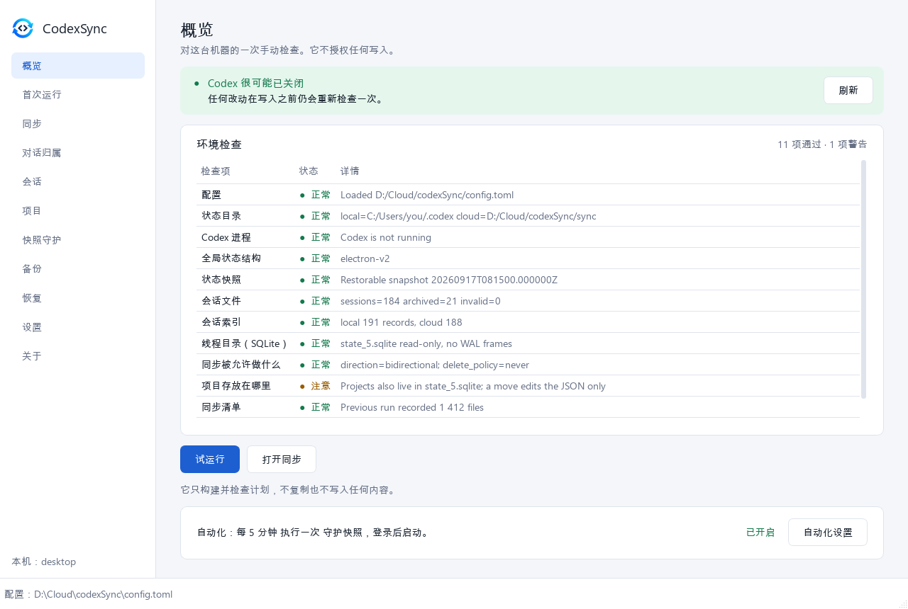

<p align="center">
  
</p>

<h1 align="center">codexSync</h1>

<p align="center">
  通过一个云同步文件夹，把本地 Codex 状态 —— 项目、对话归属和会话历史 ——
  在你自己的几台机器之间搬运。
</p>

<p align="center">
  <a href="https://github.com/kroxiksut/codexSync/actions/workflows/ci.yml"></a>
  <a href="https://github.com/kroxiksut/codexSync/releases"></a>
  
  
  
  
  <a href="./LICENSE"></a>
</p>

<p align="center">
  <a href="./README.md">English</a> · <a href="./README.ru.md">Русский</a> · <b>中文</b>
</p>

> [!IMPORTANT]
> 实测验证过的只有 Windows → Windows。macOS 在代码和 CI 中受支持，但还没有在真实的
> macOS 机器之间做过端到端的交接验证。

<p align="center">
  <a href="docs/zh/GUI.md"></a>
</p>

## 它能做什么

- **同步**本地 Codex 状态目录，通过任意云同步文件夹 —— 先备份，而且只在 Codex
  关闭时进行。→ [同步](docs/zh/SYNC.md)
- **守护全局状态**：*在 Codex 运行期间*拍摄经过校验的快照，并且只写到 `.codex`
  之外。→ [快照守护](docs/zh/GUARDIAN.md)
- **在机器之间搬运会话历史**，并对每个分支分类；分叉永远不会被合并，也不会按
  时间戳决定。→ [会话](docs/zh/SESSIONS.md)
- **找到某个对话并把它放到项目下**，在换机之后修复归属，搬移项目的文件。
  → [项目与对话](docs/zh/PROJECTS.md)
- **从被中断的写入中恢复** —— 锁、事务日志、经过校验的备份。
  → [备份与恢复](docs/zh/RECOVERY.md)

它既不与 Codex 的内部实现集成，也不做实时同步：
[它不做什么](docs/zh/README.md#它不做什么)。

## 安装

```powershell
pip install ".[gui]"     # 命令行加窗口；只要命令行用 `pip install .`
codexsync-gui            # 或者：codexsync -c config.toml doctor
```

不需要 Python 的 Windows 构建在
[Releases](https://github.com/kroxiksut/codexSync/releases) 里。完整步骤和首次
运行见[安装与上手](docs/zh/README.md#安装)。

## 文档

| | |
|---|---|
| [总览](docs/zh/README.md) | 工作方式、安装、首次运行、设计原则、平台 |
| [窗口](docs/zh/GUI.md) | 全部十一个界面及截图 |
| [命令行](docs/zh/CLI.md) | 每条命令、全局选项、退出码 |
| [配置](docs/zh/CONFIGURATION.md) | 逐节讲解 `config.toml`，以及自动化 |
| [同步](docs/zh/SYNC.md) | `plan` 与 `sync`：比较、冲突、方向、删除 |
| [快照守护](docs/zh/GUARDIAN.md) | 全局状态的快照、隔离区、还原、新的基准 |
| [会话](docs/zh/SESSIONS.md) | 跨机器的会话分支、工作集、镜像、索引 |
| [项目与对话](docs/zh/PROJECTS.md) | 对话归属、换机之后的修复、搬移项目 |
| [备份与恢复](docs/zh/RECOVERY.md) | 备份、还原、被中断的写操作 |

全部页面汇总在一处：[docs/](docs/README.zh.md)。面向贡献者（均为英文）：
[开发者文档](docs/dev/README.md)。更新日志：[CHANGELOG.md](./CHANGELOG.md)。

## 状态

0.2 —— 第一个在命令行之外带上窗口（`codexsync[gui]` 或 `codexsync-gui.exe`）的版本。
有几项运行时行为被刻意暂不使用，直到受控实验把它们记录下来 —— 见
[还没有被验证的部分](docs/zh/README.md#还没有被验证的部分)。

## 许可

双重许可：开源部分采用 `GPL-3.0-or-later`（[LICENSE](./LICENSE)），商业路径见
[COMMERCIAL_LICENSE.md](./COMMERCIAL_LICENSE.md)。贡献按
[CONTRIBUTING.md](./CONTRIBUTING.md) 和 [CLA.md](./CLA.md) 的条款接受。
