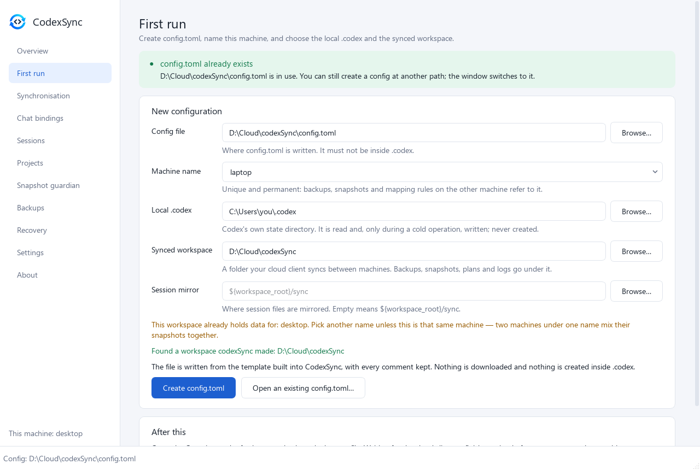
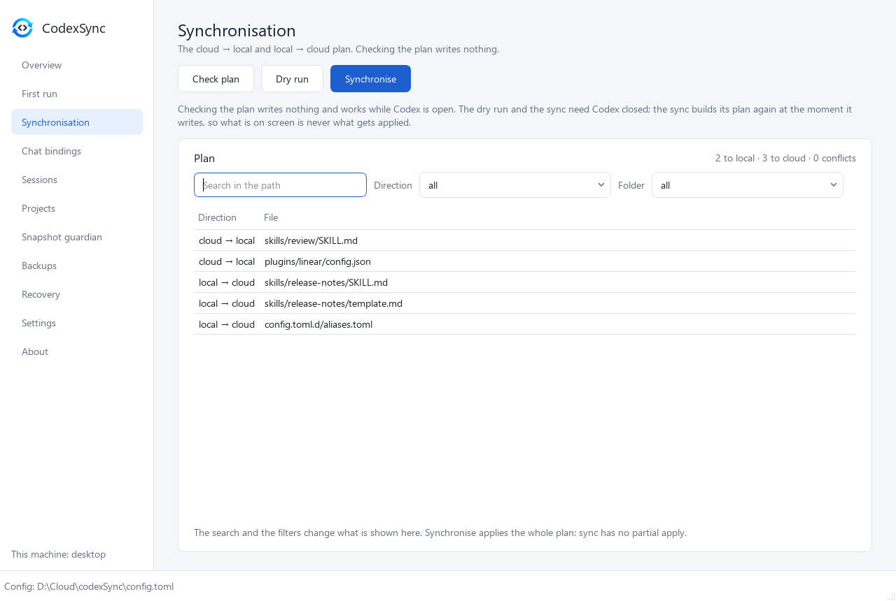
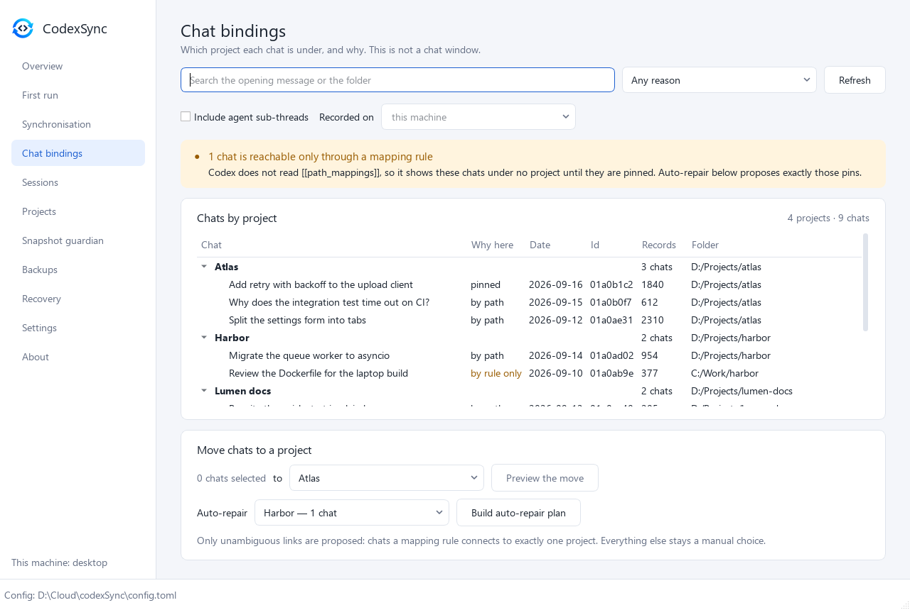
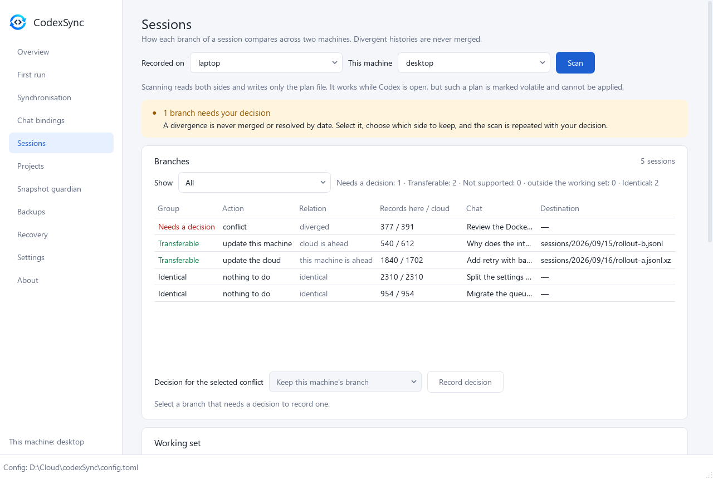
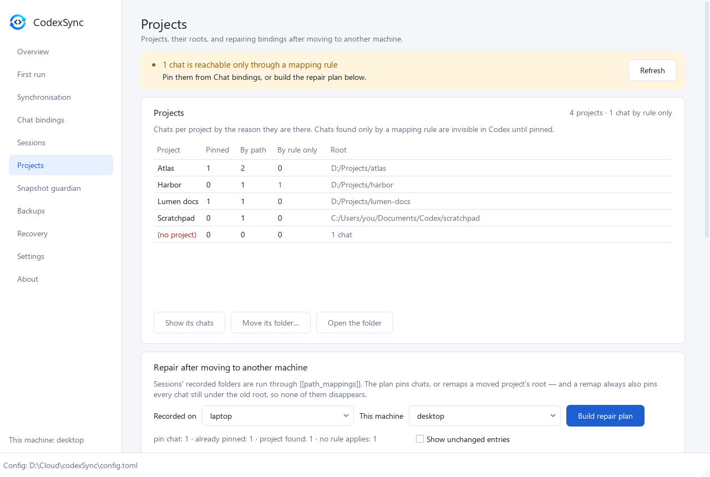
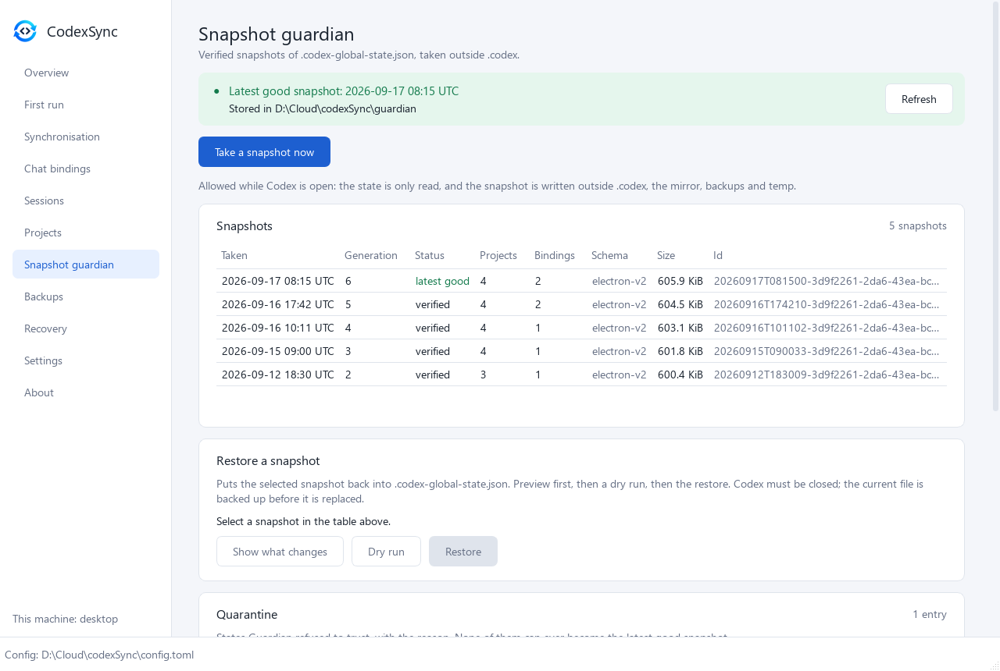
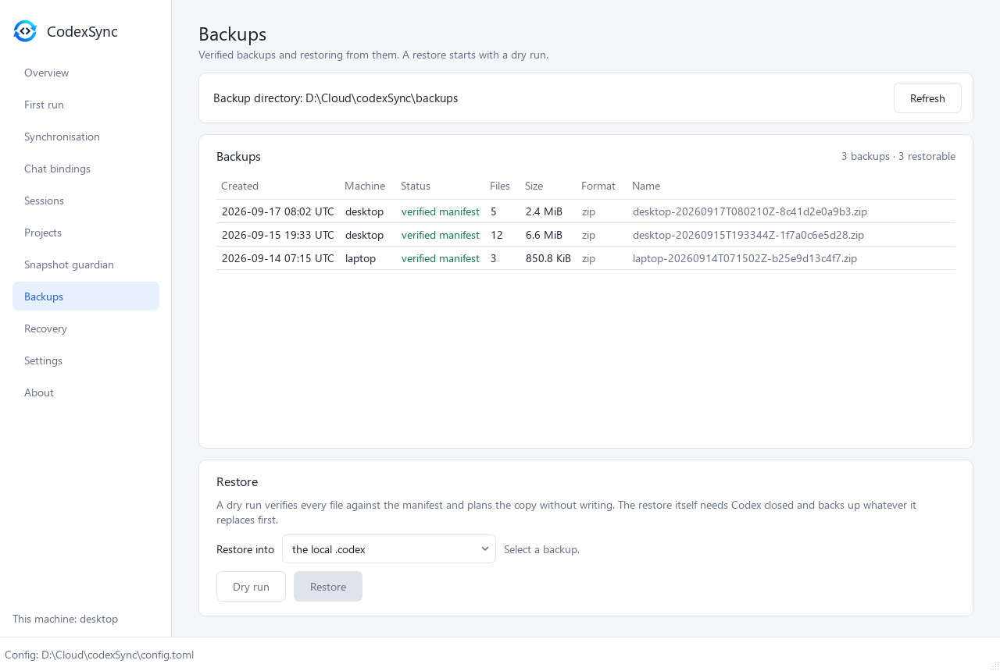
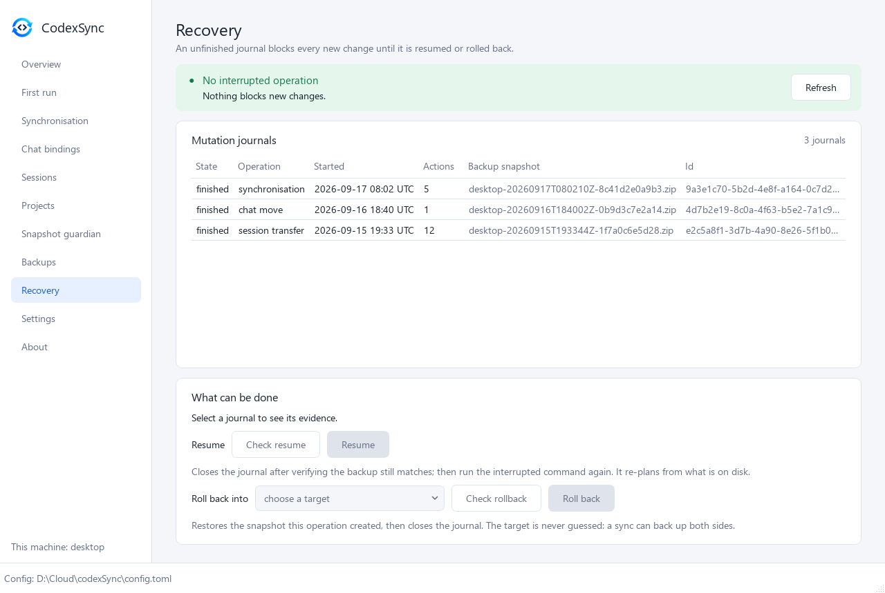
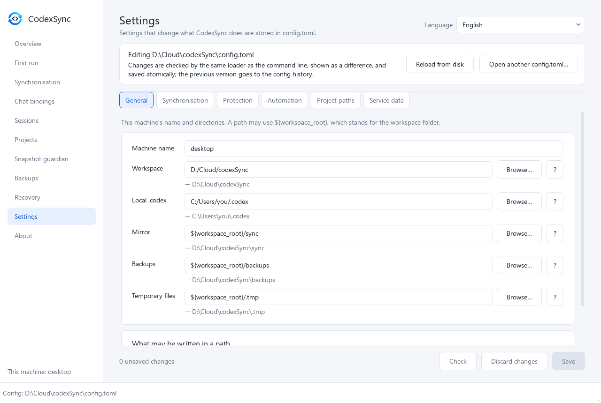
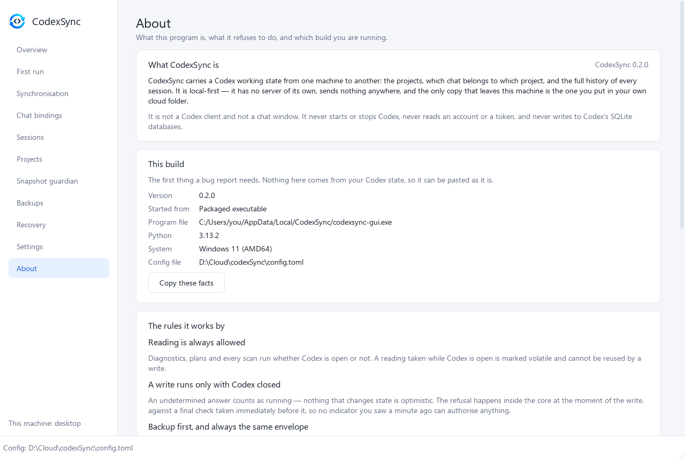

# The window

**English** · [Русский](../ru/GUI.md) · [中文](../zh/GUI.md)

[← Documentation](README.md)

The window is a second shell over the same core as the command line: it can do
nothing the CLI cannot, and it follows the same rules. It is available in
English, Russian and Chinese, with a light and a dark theme.

- [Starting it](#starting-it)
- [Safety](#safety)
- Screens: [Overview](#overview) · [First run](#first-run) ·
  [Synchronisation](#synchronisation) · [Chat bindings](#chat-bindings) ·
  [Sessions](#sessions) · [Projects](#projects) ·
  [Snapshot guardian](#snapshot-guardian) · [Backups](#backups) ·
  [Recovery](#recovery) · [Settings](#settings) · [About](#about)
- [Windows exe](#windows-exe)

The screenshots show invented demo data. They are rendered offscreen by
`python scripts/docs_screenshots.py`, which never reads a real `.codex`.

## Starting it

```powershell
pip install ".[gui]"
codexsync-gui                      # opens the config it used last
codexsync-gui -c config.toml       # or: python -m codexsync.gui -c config.toml
```

Without `-c`, the window opens the config it used last; failing that, a
`config.toml` in the current folder, beside the executable, or in the per-user
location. If there is none, it starts on the *First run* screen.

The status bar at the bottom always shows which `config.toml` is open, and the
side panel shows this machine's name.

## Safety

Nothing about the safety rules changes in the window.

- **Every write goes through the same core as the CLI** — the process gate, the
  lock, the journal, a verified backup and a final process check — and is
  refused there, whatever the button looked like. A test reads the window's
  imports to prove it cannot reach anything beneath that.
- **"Codex is probably closed" is advisory** and says so. The check that counts
  is taken again at the moment of the write.
- **Plan first, then confirm.** Every change starts with a plan or a dry run;
  the confirmation dialog quotes the exact plan id. Restore, resume and rollback
  unlock only after a dry run of the same choice.
- Long read-only scans show their progress in the status bar and can be
  abandoned there; a write cannot be.
- Plans the window applies are saved under `<workspace>/plans/`.

## Overview


A manual check of this machine; it authorises no write. The banner says whether
Codex looks closed. The table is the `doctor` report: configuration, state
directories, the Codex process, the detected global-state schema, the latest
restorable snapshot, session files, the session index, the SQLite thread
catalogue, what a sync is allowed to do, where projects are stored, and the sync
manifest. Below it: a dry run of the sync, and the state of the scheduled task
with a link to its settings.

## First run



Creates `config.toml` from the template built into CodexSync, keeping every
comment:

- **Config file** — where to write it; it must not be inside `.codex`.
- **Machine name** — unique and permanent: backups, snapshots and mapping rules
  on the other machine refer to it.
- **Local .codex** — Codex's own state directory. It is read and, only during a
  cold operation, written; never created.
- **Synced workspace** — the folder your cloud client syncs between machines.
  Backups, snapshots, plans and logs go under it.
- **Session mirror** — where session files are mirrored; empty means
  `${workspace_root}/sync`.

The screen warns when the workspace already holds data for a machine of the same
name, finds a workspace codexSync created earlier, and creates nothing inside
`.codex`. You can also open an existing `config.toml` from here.

## Synchronisation



The cloud → local and local → cloud plan.

- **Check plan** writes nothing and works while Codex is open.
- **Dry run** and **Synchronise** need Codex closed. The sync builds its plan
  again at the moment it writes, so what is on screen is never what gets
  applied.
- Search, direction and folder filters change only what is shown: a sync always
  applies the whole plan.
- Files changed on both sides are listed as conflicts and decided by
  [`conflict.policy`](SYNC.md#conflicts).

See [Synchronisation](SYNC.md).

## Chat bindings



Which project each chat is under, and why. This is not a chat window: it shows a
chat's opening message, date, id, record count and folder, grouped by project.

**Why here** is the reason a chat sits under its project:

| Reason | Meaning |
|---|---|
| pinned | An explicit binding. It follows the project if the project's path changes. |
| by path | The chat's folder falls under the project root. Moving the project leaves it behind. |
| by rule only | Only a `[[path_mappings]]` rule connects the chat to a project. Codex does not read those rules, so it shows the chat under no project until it is pinned. |

Search covers the opening message and the folder; you can filter by reason,
include agent sub-threads, and look at chats recorded on another machine.

**Move chats to a project** — select chats, choose a project and preview the
move; the write needs Codex closed and the preview's plan id. **Auto-repair**
proposes only unambiguous pins: chats a mapping rule connects to exactly one
project.

See [Projects and chats](PROJECTS.md#chats).

## Sessions



How each branch of a session compares across two machines. Choose where the
sessions were recorded and which machine this is, then **Scan**. Scanning reads
both sides and writes only the plan file; a plan made while Codex is open is
marked volatile and cannot be applied.

Each branch is shown with its group (needs a decision, transferable, not
supported, outside the working set, identical), the action, the relation
("cloud is ahead", "this machine is ahead", "diverged"…), records on each side,
the chat and the destination.

- **A divergence is never merged or resolved by date.** Select it, choose which
  side to keep and **Record decision**; the scan is repeated with it.
- **Working set** narrows what is written into `.codex` to chosen projects and
  chats. The cloud mirror always receives every session.
- **Session index** shows what each side's `session_index.jsonl` holds.
- Dry run, then apply by the exact plan id.

See [Sessions](SESSIONS.md).

## Projects



Projects, their roots and their chats counted by reason (pinned, by path, by rule
only), plus chats under no project. Select a project to **show its chats**,
**move its folder** or **open the folder**.

- **Move its folder…** copies the project into a new folder, verifies every
  file, and only then points Codex at the new root. The old folder is never
  modified or deleted.
- **Repair after moving to another machine** runs the sessions' recorded folders
  through `[[path_mappings]]` and builds a plan: pin chats, or remap a moved
  project's root. A remap always also pins every chat still under the old root,
  so none of them disappears. Dry run, then apply by id.

See [Projects and chats](PROJECTS.md).

## Snapshot guardian



Verified snapshots of `.codex-global-state.json`, taken outside `.codex`.

- The banner shows the latest good snapshot and where snapshots are stored.
- **Take a snapshot now** is allowed while Codex is open: the state is only read.
- **Snapshots** lists each snapshot with its generation, status, project and
  binding counts, schema and size.
- **Restore a snapshot** — select one, *Show what changes*, *Dry run*, then
  *Restore*. Codex must be closed; the current file is backed up first.
- **Quarantine** lists states Guardian refused to trust, with the reason. None
  of them can ever become the latest good snapshot.
- **Accept the current state as the new baseline** appears when a real drop in
  projects or bindings has frozen `latest-good`; it explains the drop in counts
  only.

See [Guardian](GUARDIAN.md).

## Backups



The backups in the backup directory with the machine that made them, whether
their manifest verifies, file count, size and format. **Restore** — choose a
backup and a target (the local `.codex` or the cloud mirror), run the dry run,
which verifies every file against the manifest; the restore itself unlocks only
after that, needs Codex closed, and backs up whatever it replaces first.

See [Backups and recovery](RECOVERY.md).

## Recovery



Every write keeps a journal. An unfinished journal blocks every new change until
it is resumed or rolled back — that block is the protection.

- **Mutation journals** — state, operation, start time, number of actions,
  backup snapshot and id.
- **Resume** closes the journal after verifying the backup still matches; then
  run the interrupted command again, which re-plans from what is on disk.
- **Roll back into** restores the snapshot the operation created, then closes the
  journal. The target is never guessed: a sync can back up both sides.

Each action has its own check (dry run) that must pass first.

See [Backups and recovery](RECOVERY.md#interrupted-mutations).

## Settings



**Settings are `config.toml`.** The file is read into a draft; nothing is
written until you save.

| Tab | What it holds |
|---|---|
| General | Machine name and directories. Each path shows what it resolves to; `${workspace_root}` stands for the workspace folder. |
| Synchronisation | Comparison, conflict policy, direction, deletions, what is included (picked from a tree) and excluded. |
| Protection | Process detection and Guardian. `safety.*` is shown but never editable. |
| Automation | The scheduled task: its job, interval and start after sign-in; whether the installed task matches the config, its last and next run, and what the last exit code meant. |
| Project paths | `[[path_mappings]]` rules, written in a form. |
| Service data | Backups, the session mirror, the sync manifest, logging, and the config history. |

A save rewrites only the values that changed and keeps every comment, is
validated by the same loader the command line uses, shows the difference, is
refused if the file changed on disk since it was opened, and keeps the replaced
version under `<workspace>/config-history/`. Open plans are discarded afterwards.
A setting the rules forbid is shown with its reason.

**A config from an earlier version** is announced at the top of this screen:
the 0.1 template set two values this version refuses for every write, so such a
file blocks `sync`, `restore` and every repair until it is brought up to date.
The card lists what would change and why, shows the exact difference, and
applies it all in one confirmed write that keeps your comments and copies the
replaced file into `config-history/`. An optional finding can be left alone with
its own tick. See
[Configuration → Upgrading a config from an earlier version](CONFIGURATION.md#upgrading-a-config-from-an-earlier-version).

The language switch is at the top of the screen. The window itself remembers
only its size, the last screen, the language and which config it opened last —
never the contents of `config.toml`.

**Automation** can run only a safe job — a Guardian snapshot, `preflight` or a
sync dry run — never a write. See
[Configuration → Automation](CONFIGURATION.md#automation).

## About



What the program is, the four rules every write obeys, what it deliberately
leaves to you, and **this build** — version, whether it is a packaged
executable or a source checkout, the program file, Python, the system and the
config file in use. *Copy these facts* puts those lines on the clipboard for a
bug report; none of them comes from your Codex state, so they can be pasted as
they are.

The licence block names GPL-3.0-or-later and the separate commercial licence,
and states that the core and the command line have no third-party dependencies
while this window uses Qt through PySide6 under the LGPL-3.0. The links open
the documentation in the window's language, the project page, the changelog
and the issue tracker in your browser.

## Windows exe

`codexsync-gui.exe` is the windowed app, and it is also the command line: given a
command (`codexsync-gui.exe -c config.toml validate`) it runs that command without
opening a console, which is what a scheduled task of a frozen install runs. The
console-only `codexsync.exe` ships separately, without Qt.

Building both is described in [the release checklist](../dev/PUBLISHING.md#c-windows-exe).
