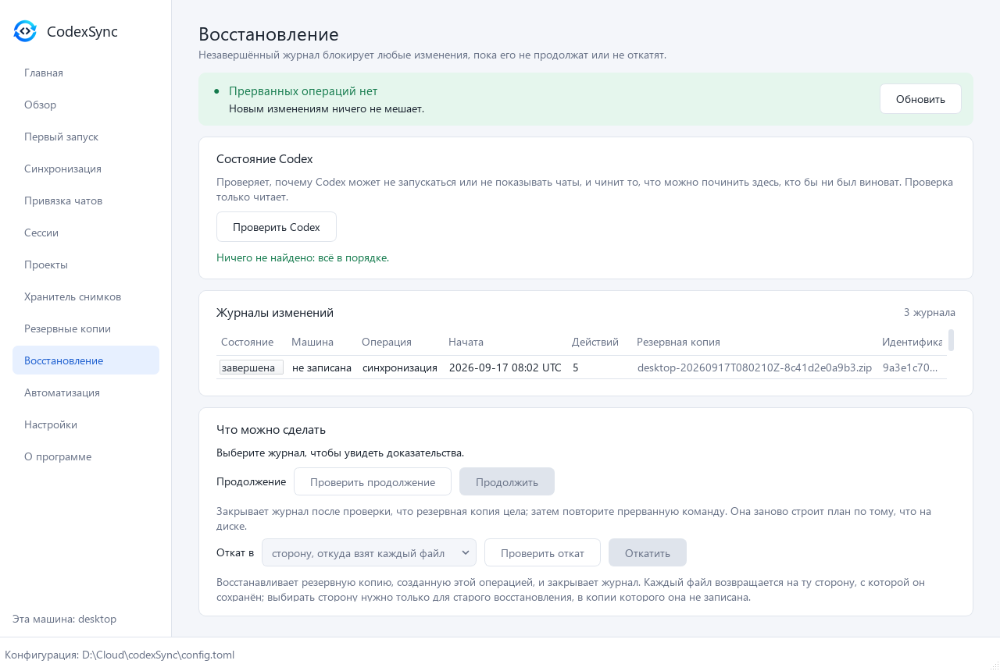
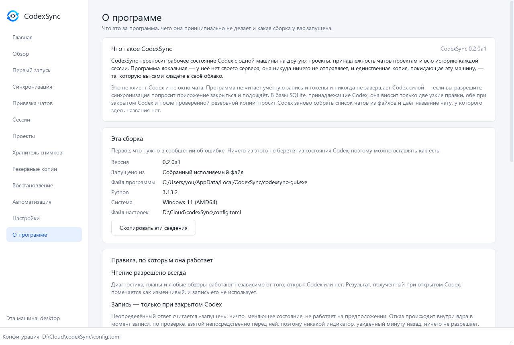

# Окно

[English](../en/GUI.md) · **Русский** · [中文](../zh/GUI.md)

[← Документация](README.md)

Окно — вторая оболочка над тем же ядром, что и командная строка: оно не умеет
ничего, чего не умеет CLI, и подчиняется тем же правилам. Есть английский,
русский и китайский языки, светлая и тёмная темы.

- [Запуск](#запуск)
- [Безопасность](#безопасность)
- Экраны: [Главная](#главная) · [Обзор](#обзор) · [Первый запуск](#первый-запуск) ·
  [Синхронизация](#синхронизация) · [Привязка чатов](#привязка-чатов) ·
  [Сессии](#сессии) · [Проекты](#проекты) ·
  [Хранитель снимков](#хранитель-снимков) · [Резервные копии](#резервные-копии) ·
  [Восстановление](#восстановление) · [Автоматизация](#автоматизация) ·
  [Настройки](#настройки) ·
  [О программе](#о-программе)
- [Windows exe](#windows-exe)

На скриншотах вымышленные демо-данные. Их рисует без окна
`python scripts/docs_screenshots.py`, который никогда не читает настоящую
`.codex`.

## Запуск

```powershell
python -m pip install --upgrade --pre "codexsync[gui]"
codexsync-gui                      # открывает конфигурацию, открытую в прошлый раз
codexsync-gui -c config.toml       # или: python -m codexsync.gui -c config.toml
```

Из исходников вместо этого — `pip install -e ".[gui]"`
([установка](README.md#установка)).

Без `-c` окно открывает конфигурацию, с которой работало в прошлый раз; если её
нет — `config.toml` в текущей папке или рядом с исполняемым файлом. Если нет ни
одной, окно начинает с экрана «Первый запуск», а все остальные страницы
предлагают открыть существующий `config.toml` из любой папки или создать новый
там, где вы скажете. Место за вас не выбирается, а существующий файл, выбранный
в поле «Файл конфигурации», открывается, а не перезаписывается.

Строка состояния внизу всегда показывает, какой `config.toml` открыт, а боковая
панель — имя этой машины.

## Безопасность

Правила безопасности в окне не меняются.

- **Любая запись идёт через то же ядро, что и в CLI**: проверка процесса,
  блокировка, журнал, проверенная резервная копия и финальная проверка процесса —
  и отклоняется там, как бы ни выглядела кнопка. Тест читает импорты окна и
  доказывает, что глубже оно не дотягивается.
- **Плашка «Codex, вероятно, закрыт» — подсказка**, и так и подписана. Решающая
  проверка выполняется заново в момент записи.
- **Сначала план, потом подтверждение.** Каждое изменение начинается с плана или
  проверочного запуска; диалог подтверждения называет точный id плана.
  Восстановление, продолжение и откат становятся доступны только после
  проверочного запуска того же выбора.
- Долгие операции чтения показывают ход в строке состояния, и их можно прервать
  там же; запись прервать нельзя.
- Планы, которые применяет окно, сохраняются в `<workspace>/plans/`.

## Главная


Первая страница: эта машина одним взглядом, рядом с «Обзором», а не вместо
него. Плашка говорит, похоже ли, что Codex открыт (это лишь подсказка, как и
любая такая строка), и по плитке на каждое: последняя синхронизация с числом
запусков, сбоев и перенесённых файлов за 30 дней и ссылкой на историю; чаты и
проекты; копии `.codex`; резервные копии перед записью; хранитель снимков;
какие задачи автоматизации включены и совпадают ли они в операционной системе с
конфигурацией. Незавершённый журнал объявляется здесь так же, как в «Обзоре».

Всё, кроме числа чатов, читается при открытии страницы и не открывает ни одного
файла сессии. Подсчёт чатов читает каждую сессию, поэтому эти числа берутся из
последнего сканирования — на странице «Привязка чатов» или кнопкой
«Пересчитать», — показываются со временем подсчёта и хранятся в папке кэша
приложения (`%LOCALAPPDATA%\CodexSync\cache` в Windows): только числа, никогда
имя, путь или заголовок. Часть, которую не удалось прочитать, — одна плитка с
причиной.

## Обзор


Ручная проверка этой машины; она не разрешает запись. Плашка говорит, похоже ли,
что Codex закрыт. Таблица — это отчёт `doctor`: конфигурация, каталоги
состояния, процесс Codex, распознанная схема глобального состояния, последний
восстановимый снимок, файлы сессий, индекс сессий, каталог потоков в SQLite, что
разрешено синхронизации, где хранятся проекты и манифест синхронизации. Ниже —
проверочный запуск синхронизации, последняя синхронизация со ссылкой на её
историю и состояние задачи расписания со ссылкой на страницу «Автоматизация».

## Первый запуск


Создаёт `config.toml` из шаблона, встроенного в CodexSync, со всеми
комментариями:

- **Файл конфигурации** — куда его записать; не внутри `.codex`.
- **Имя машины** — уникальное и постоянное: на него ссылаются резервные копии,
  снимки и правила соответствия путей на другой машине.
- **Локальная .codex** — собственный каталог состояния Codex. Он читается и
  только во время холодной операции пишется; никогда не создаётся.
- **Синхронизируемая папка** — папка, которую облачный клиент синхронизирует
  между машинами. В ней лежат резервные копии, снимки, планы и журналы.
- **Зеркало сессий** — куда зеркалируются файлы сессий; пусто — значит
  `${workspace_root}/sync`.

Экран предупреждает, если в рабочей папке уже есть данные машины с тем же
именем, находит рабочую папку, созданную codexSync раньше, и ничего не создаёт
внутри `.codex`. Отсюда же можно открыть существующий `config.toml`.

## Синхронизация


План «облако → локально» и «локально → облако».

- **Проверить план** ничего не пишет и работает при открытом Codex.
- **Проверочный запуск** и **Синхронизировать** требуют закрытого Codex.
  Синхронизация строит план заново в момент записи, поэтому применяется не то,
  что на экране, а актуальное состояние.
- **Синхронизировать** — это полная синхронизация: настройки, затем чаты,
  затем список проектов; пока она идёт, видно, на каком она этапе, а в конце —
  что сделано: файлы, чаты, добавленные проекты. План и проверочный запуск
  касаются файлов настроек.
- Поиск и фильтры по направлению и папке меняют только показ: синхронизация
  всегда применяет план целиком. **Этот запуск** рядом с кнопками — другое: он
  задаёт направление только для следующего проверочного запуска или
  синхронизации (`--direction` в командной строке), а «направление из настроек»
  возвращает к настройке.
- Файлы, изменённые с обеих сторон, показываются как конфликты и решаются по
  [`conflict.policy`](SYNC.md#конфликты). Синхронизация, остановившаяся на
  конфликте файла или чата, прямо под сообщением предлагает *Оставить более
  свежие*, *Оставить версии этой машины* и *Оставить версии из облака*, а
  *Всегда решать так* сохраняет выбор как политику.
- Вкладка **История** показывает прошлые запуски: когда, что (файлы настроек,
  чаты, проекты — одна полная синхронизация занимает три строки), итог, кто
  запустил, что перенесено и какая резервная копия. См.
  [Синхронизация → История](SYNC.md#история).

См. [Синхронизация](SYNC.md).

## Привязка чатов


Под каким проектом находится каждый чат и почему. Это не окно общения: здесь
видны первое сообщение чата, дата, id, число записей и папка, сгруппированные по
проектам.

**Почему здесь** — причина, по которой чат находится под проектом:

| Причина | Что значит |
|---|---|
| закреплён явно | Явная привязка. Следует за проектом, если у того меняется путь. |
| найден по пути | Папка чата лежит внутри корня проекта. При переезде проекта чат останется позади. |
| только по правилу | Чат связан с проектом только правилом `[[path_mappings]]`. Codex эти правила не читает, поэтому показывает такой чат вне проектов, пока его не закрепить. |

Поиск идёт по первому сообщению и папке; можно фильтровать по причине, включать
подпотоки агентов и смотреть чаты, записанные на другой машине.

**Перенос чатов в проект** — выберите чаты и проект и посмотрите предпросмотр
переноса; запись требует закрытого Codex и id плана из предпросмотра.
**Авторемонт** предлагает только однозначные привязки: чаты, которые правило
соответствия связывает ровно с одним проектом.

См. [Проекты и чаты](PROJECTS.md#чаты).

## Сессии


Как каждая ветка сессии соотносится между двумя машинами. Выберите, где записаны
сессии и какая машина эта, и нажмите **Сканировать**. Сканирование читает обе
стороны и пишет только файл плана; план, построенный при открытом Codex,
помечается как предварительный, и применить его нельзя.

Для каждой ветки видны группа (требуют решения, можно перенести, не
поддерживаются, вне рабочего набора, совпадают), действие, соотношение («облако
впереди», «эта машина впереди», «разошлись»…), число записей с каждой стороны,
чат и назначение.

- **Расхождение никогда не сливается и не решается по дате.** Выберите его,
  укажите, какую сторону оставить, и нажмите **Записать решение**; сканирование
  повторится с ним.
- **Рабочий набор** сужает то, что пишется в `.codex`, до выбранных проектов и
  чатов. Облачное зеркало всегда получает все сессии.
- **Индекс сессий** показывает, что лежит в `session_index.jsonl` с каждой
  стороны.
- Проверочный запуск, затем применение по точному id плана.

См. [Сессии](SESSIONS.md).

## Проекты


Проекты, их корни и число чатов по причинам (закреплены, по пути, только по
правилу), а также чаты без проекта. Выберите проект, чтобы **показать чаты**,
**переместить папку** или **открыть папку**.

- **Переместить папку…** копирует проект в новую папку, проверяет каждый файл и
  только потом переключает Codex на новый корень. Старая папка никогда не
  меняется и не удаляется.
- **Ремонт после перехода на другую машину** пропускает записанные в сессиях
  папки через `[[path_mappings]]` и строит план: закрепить чаты или сменить
  корень переехавшего проекта. Смена корня всегда закрепляет и все чаты, которые
  остались под старым корнем, чтобы ни один не пропал. Проверочный запуск, затем
  применение по id.

См. [Проекты и чаты](PROJECTS.md).

## Хранитель снимков


Проверенные снимки `.codex-global-state.json`, которые создаются вне `.codex`.

- Плашка показывает последний проверенный снимок и где хранятся снимки.
- **Снять снимок сейчас** можно при открытом Codex: состояние только читается.
- **Снимки** — у каждого поколение, состояние, число проектов и привязок, схема и
  размер.
- **Восстановление из снимка** — выберите снимок, *Показать изменения*,
  *Проверочный запуск*, затем *Восстановить*. Codex должен быть закрыт; текущий
  файл сначала сохраняется в резервную копию.
- **Карантин** — состояния, которым хранитель отказался доверять, с причиной.
  Ни одно из них не может стать последним проверенным снимком.
- **Принять текущее состояние новой базой** появляется, когда настоящая потеря
  проектов или привязок заморозила `latest-good`; объяснение — только числами.

См. [Хранитель снимков](GUARDIAN.md).

## Резервные копии


Резервные копии в каталоге резервных копий: какая машина сделала, проверен ли
манифест, число файлов, размер и формат. **Восстановление** — выберите копию и
цель (локальную `.codex` или облачное зеркало) и выполните проверочный запуск,
который сверяет каждый файл с манифестом; само восстановление станет доступно
только после него, требует закрытого Codex и сначала сохраняет всё, что заменит.

Эти копии каждая запись делает сама — из того, что собирается заменить.
Полная копия `.codex` — блок ниже: **Копии .codex** показывает копии в папке и
кнопку **Сделать копию сейчас** (при закрытом Codex). Это то же, что на
«Автоматизации», и одна задача для обеих страниц; папка выбирается там
(**Настроить…**). См. [Копии `.codex`](CONFIGURATION.md#копии-codex).

См. [Резервные копии и восстановление](RECOVERY.md).

## Восстановление



Каждая запись ведёт журнал. Незавершённый журнал блокирует любые изменения, пока
его не продолжат или не откатят, — эта блокировка и есть защита.

- **Журналы изменений** — состояние, операция, время начала, число действий,
  резервная копия и id.
- **Продолжить** закрывает журнал, убедившись, что резервная копия цела; затем
  запустите прерванную команду заново — она построит план по тому, что на диске.
- **Откат в** восстанавливает резервную копию, сделанную этой операцией, и
  закрывает журнал. Каждый файл возвращается на ту сторону, с которой он сохранён;
  выбирать сторону нужно только для старого восстановления, в копии которого она
  не записана.

У каждого действия есть своя проверка, которая должна пройти первой.

См. [Резервные копии и восстановление](RECOVERY.md#прерванные-операции).

## Автоматизация


Все задачи, которые операционная система выполняет для CodexSync, на одной
странице и редактируются так же, как в «Настройках»: значения — это
`config.toml`, а «Сохранить и обновить задачи» сохраняет их (с обычной
проверкой), затем устанавливает включённое и удаляет выключенное.

- **Регулярное безопасное действие** — снимок хранителя, `preflight` или
  проверочный запуск синхронизации, никогда не запись; интервал, запуск после
  входа и случайная задержка; совпадает ли установленная задача с
  конфигурацией, прошлый и следующий запуск и что означал последний код
  выхода. «Выполнить сейчас» запускает действие в окне.
- **После входа в систему** — задержка для всего, что запускается при входе,
  однократная синхронизация и **«Закрывать Codex, если синхронизация началась
  при открытом»** (`[sync] close_codex`): Codex просят закрыться так, как Windows
  закрывает программу перед обновлением, никогда не силой; если он не закрылся,
  ничего не записывается. См. [Конфигурация](CONFIGURATION.md#автоматизация).
- **Копии `.codex`** — папка (выбираете вы; ничего не предлагается), копия
  после входа и/или каждые N часов, сколько хранить, существующие копии и
  «Сделать копию сейчас», которая отказывается при открытом Codex: ждёт задача,
  а не окно.
- **Синхронизация при выходе и входе** — наблюдатель, который загружает при
  входе и синхронизирует при закрытии Codex, сколько ждать, пока доедет работа
  другой машины, уведомления; таблица всех машин (работает или передала, с
  какого времени и загружена ли здесь её последняя передача) и
  «Синхронизировать сейчас», которая не ждёт облако: то, что доехало не
  полностью, отклоняется. Папку выбирать не нужно: это папка `handoff` рядом с
  manifest синхронизации. См.
  [Синхронизация → Передача работы между машинами](SYNC.md#передача-работы-между-машинами).

См. [Конфигурация → Автоматизация](CONFIGURATION.md#автоматизация) и
[Копии `.codex`](CONFIGURATION.md#копии-codex).

## Настройки


**Настройки — это `config.toml`.** Файл читается в черновик; ничего не
записывается, пока вы не сохраните.

| Вкладка | Что в ней |
|---|---|
| Основное | Имя машины и каталоги. Под каждым путём видно, во что он раскрывается; `${workspace_root}` означает рабочую папку. |
| Синхронизация | Сравнение, политика конфликтов, направление, удаления, что включено (выбирается из дерева) и что исключено. |
| Защита | Определение процесса Codex и хранитель снимков. `safety.*` показывается, но не редактируется. |
| Пути проектов | Правила `[[path_mappings]]` в виде формы. |
| Служебные данные | Резервные копии, зеркало сессий, манифест синхронизации, журналы и история конфигурации. |

Сохранение меняет только изменённые значения и оставляет все комментарии,
проверяется тем же загрузчиком, что и командная строка, показывает различия,
отклоняется, если файл изменился на диске с момента открытия, и кладёт прежнюю
версию в `<workspace>/config-history/`. После сохранения открытые планы
сбрасываются. Запрещённое правилами значение показывается вместе с причиной.

**Конфигурация от предыдущей версии** объявляется вверху этого экрана:
шаблон 0.1 задавал два значения, которые эта версия отвергает для любой записи,
поэтому такой файл блокирует `sync`, `restore` и любую починку, пока его не
обновят. Карточка перечисляет, что изменится и почему, показывает точный дифф и
применяет всё одной подтверждённой записью, сохраняя ваши комментарии и копируя
заменённый файл в `config-history/`. Необязательную находку можно оставить как
есть отдельной галочкой. Искать эту карточку не нужно: когда такой файл
открывается или с ним запускается окно, над каждой страницей появляется полоса
с кнопкой **Посмотреть и обновить**, которая открывает карточку развёрнутой
(одни лишь необязательные отличия полосу не вызывают). Запись, отклонённая по
этой причине, говорит то же самое на языке окна. См.
[Конфигурация → Обновление конфигурации от предыдущей версии](CONFIGURATION.md#обновление-конфигурации-от-предыдущей-версии).

Переключатель языка — в верхней части экрана. Само окно помнит только размер,
последний экран, язык и какую конфигурацию открывало последней — но никогда не
содержимое `config.toml`.

## О программе



Что это за программа, четыре правила, которым подчиняется любая запись, что
она сознательно оставляет на вас, и **эта сборка** — версия, собранный
исполняемый файл или исходники, файл программы, Python, система и открытая
конфигурация. «Скопировать эти сведения» кладёт эти строки в буфер обмена для
сообщения об ошибке: ничего из них не берётся из состояния Codex, поэтому их
можно вставлять как есть.

Блок лицензии называет GPL-3.0-or-later и отдельную коммерческую лицензию и
говорит, что у ядра и командной строки нет сторонних зависимостей, а это окно
рисует себя при помощи Qt через PySide6 под LGPL-3.0. Ссылки открывают в
браузере документацию на языке окна, страницу проекта, историю изменений и
трекер задач.

## Windows exe

`codexsync-gui.exe` — это и окно, и командная строка: с командой
(`codexsync-gui.exe -c config.toml validate`) он выполняет её без консоли; именно
так его запускает задача расписания у установленной сборки. Консольный
`codexsync.exe` без Qt поставляется отдельно.

Как собрать обе, написано в [чек-листе выпуска](../dev/PUBLISHING.md#c-windows-exe)
(на английском).
