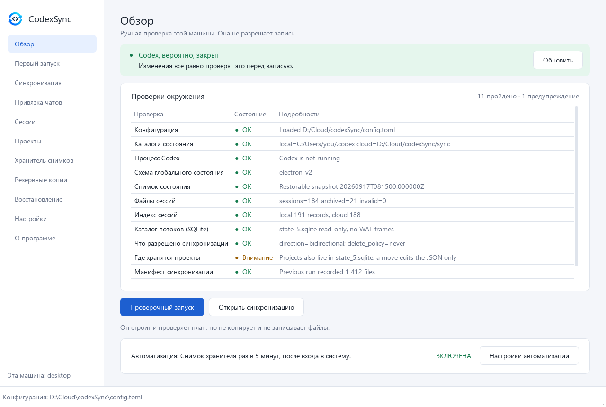

# Документация codexSync

[English](../en/README.md) · **Русский** · [中文](../zh/README.md)

[← Страница проекта](../../README.ru.md)

| Страница | О чём |
|---|---|
| [Окно](GUI.md) | Все одиннадцать экранов со скриншотами |
| [Командная строка](CLI.md) | Все команды, общие параметры, коды выхода |
| [Конфигурация](CONFIGURATION.md) | `config.toml` по секциям, автоматизация |
| [Синхронизация](SYNC.md) | `plan` и `sync`: сравнение, конфликты, направление, удаления |
| [Хранитель снимков](GUARDIAN.md) | Снимки глобального состояния, карантин, восстановление, новая база |
| [Сессии](SESSIONS.md) | Ветки сессий между машинами, рабочий набор, зеркало, индекс |
| [Проекты и чаты](PROJECTS.md) | Привязки чатов, ремонт после переезда, перенос проекта |
| [Резервные копии и восстановление](RECOVERY.md) | Резервные копии, восстановление, прерванные операции |

[](GUI.md)

*Окно над тем же ядром, что и командная строка — [все экраны со скриншотами](GUI.md).*

## Зачем

Разработчик хочет продолжить работу с Codex на другой машине, не потеряв его
локальное состояние: проекты, то, какой чат к какому проекту относится, и историю
каждой сессии. Всё это Codex хранит в локальном каталоге (`.codex`), и одной
облачной папки недостаточно, чтобы перенести его безопасно: файл, скопированный
в момент, когда Codex его пишет, или история, выросшая на обеих машинах,
теряются без всякой ошибки.

## Как это работает

1. **Запущен ли Codex?** Ответ «не удалось определить» считается «запущен»:
   ничто, что меняет состояние, не делается оптимистично.
2. **Читать можно всегда.** `doctor`, `plan`, любые `scan`, `chats` и хранитель
   снимков работают при открытом и закрытом Codex. Результат, полученный при
   открытом Codex, помечается `volatile`, и запись не может его использовать.
3. **Запись выполняется только при закрытом Codex и всегда одинаково:**
   блокировка, которую никто другой не перехватит, долговечный журнал,
   проверенная резервная копия всего, что будет заменено, финальная проверка
   процесса прямо перед фиксацией, подготовка на том же томе, атомарная замена и
   `COMMITTED`.
4. **Любая неоднозначность останавливает операцию**, а не решается догадкой, и
   [код выхода](CLI.md#коды-выхода) говорит, какого рода была остановка.

## Установка

У ядра и командной строки нет зависимостей. Окно — необязательное дополнение.

```powershell
git clone https://github.com/kroxiksut/codexSync
cd codexSync
pip install .            # только командная строка
pip install ".[gui]"     # командная строка и окно (PySide6)
```

На Windows можно вместо этого скачать готовую сборку из
[Releases](https://github.com/kroxiksut/codexSync/releases) — ни одной из них не
нужен установленный Python: `codexsync-gui-<tag>-windows-amd64.zip` (окно, оно
же командная строка) или `codexsync-<tag>-windows-amd64.zip` (только командная
строка, без Qt).

## Первый запуск

**Окно:**

```powershell
codexsync-gui
```

Экран «Первый запуск» создаёт `config.toml`: имя машины, локальную `.codex` и
синхронизируемую папку рабочего пространства. Все экраны показаны на странице
[Окно](GUI.md).

**Командная строка:**

```powershell
codexsync init-config --output config.toml --machine-id desktop --local-state-dir C:/Users/me/.codex --workspace-root D:/Cloud/codexSync
codexsync -c config.toml doctor           # диагностика, только чтение
codexsync -c config.toml sync --dry-run   # что сделала бы синхронизация, ничего не пишет
codexsync -c config.toml sync --apply     # Codex должен быть закрыт
```

Все команды и их параметры — на странице [Командная строка](CLI.md); файл,
который пишет `init-config`, разобран по секциям в
[Конфигурации](CONFIGURATION.md).

## Принципы

- **Сначала резервная копия, при сомнении — отказ.** Неопределённость никогда не
  трактуется оптимистично.
- **Одна инстанция, один конверт.** Ровно одно место решает, можно ли менять
  состояние, и ровно один путь выполняет изменение.
- **Говорить почему, а не угадывать.** Ветка, которую нельзя классифицировать,
  проект с двумя кандидатами, поведение Codex, которое никто не наблюдал, —
  каждое сообщается кодом, а не приближается.
- **Сначала план, потом подтверждение по id.** Каждая пишущая команда сначала
  показывает план или проверочный запуск и применяет только тот id плана,
  который вы назвали. Если за это время что-то изменилось, id уже не совпадает, и
  ничего не записывается.
- **Никакой интеграции во внутренности Codex.** codexSync никогда не запускает и
  не закрывает Codex, не читает токены и не пишет в SQLite.
- **Ноль внешних зависимостей** в ядре и командной строке.

## Порядок переноса

codexSync рассчитан на строгий порядок работы между машинами:

1. Закрыть Codex на машине A.
2. Дождаться, пока облачный клиент полностью выгрузит изменения машины A.
3. Запустить codexSync на машине B.
4. Запускать Codex на машине B только после завершения синхронизации.
5. Заново войти в Codex на машине B.

Токены аутентификации не переносятся никогда. codexSync намеренно не проверяет,
закончил ли облачный провайдер синхронизацию, работает ли облачный клиент и
хватает ли места в облачной папке: это ответственность пользователя.

## Чего не делает

- Не интегрируется во внутренности Codex, не использует API, не перехватывает
  сетевой трафик.
- Не извлекает токены: после переноса в Codex нужно войти заново.
- Никогда не запускает и не закрывает Codex и не пишет в его базы SQLite.
- Не синхронизирует в реальном времени: работает одна машина за раз.
- Не проверяет облачный клиент и свободное место в облачной папке.

## Платформы

- **Windows** — проверенная платформа.
- **macOS** (Apple Silicon) поддержан в коде и CI. Определение процесса Codex для
  macOS и Linux написано и покрыто тестами на записанном выводе `ps`, но пока
  его не запустили на живом Codex, платформа сообщает о себе как о
  неподдерживаемой: состояние процесса читается как «неопределённое», и все
  пишущие команды отказывают.
- **Linux** пока вне рамок проекта.
- CI прогоняет тесты на `windows-latest` и `macos-latest` с Python 3.11, 3.12 и
  3.13.

## Что пока не подтверждено

Часть поведения Codex нельзя узнать из его файлов — только пронаблюдать. Пока
контролируемый эксперимент на расходуемом состоянии этого не зафиксирует,
codexSync сообщает о случае, а не угадывает:

| Что | Как это видно | Эксперимент |
|---|---|---|
| Запись перенесённой ветки сессии *внутрь* `.codex` | `BLOCKED_UNPROVEN_LAYOUT` | [session-layout-adapter](../dev/experiments/session-layout-adapter.md) |
| Перезапись `session_index.jsonl` | `UNPROVEN_CONSUMER_CONTRACT` | [session-index-contract](../dev/experiments/session-index-contract.md) |
| Определение Codex на macOS и Linux | платформа не поддерживается, запись закрыта | [process-detector-macos](../dev/experiments/process-detector-macos.md) |
| Проекты в `state_*.sqlite` | перенос проекта меняет только JSON; удаление и объединение проектов не предлагаются | [project-registry-contract](../dev/experiments/project-registry-contract.md) |

О последнем `doctor` сообщает при каждом запуске. Описания экспериментов — на
английском.
