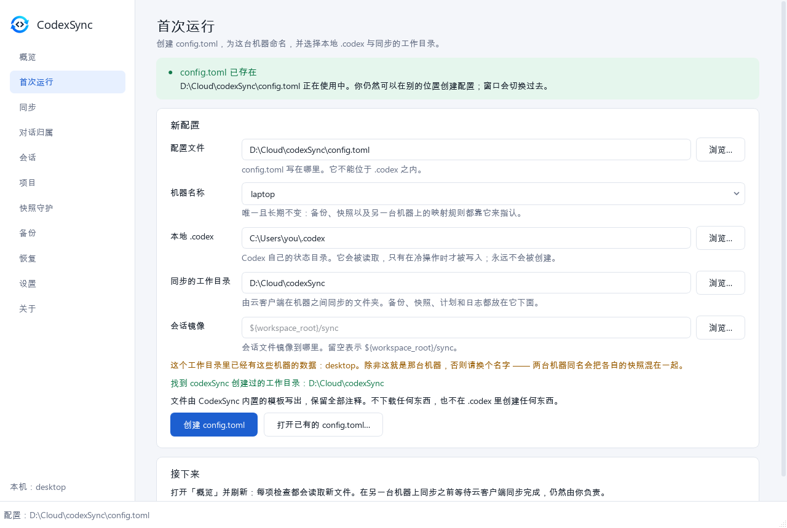
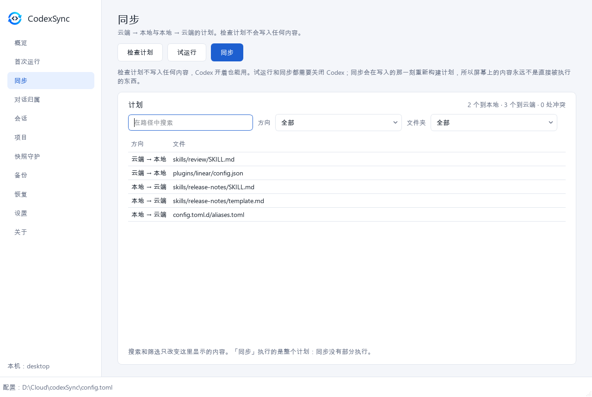
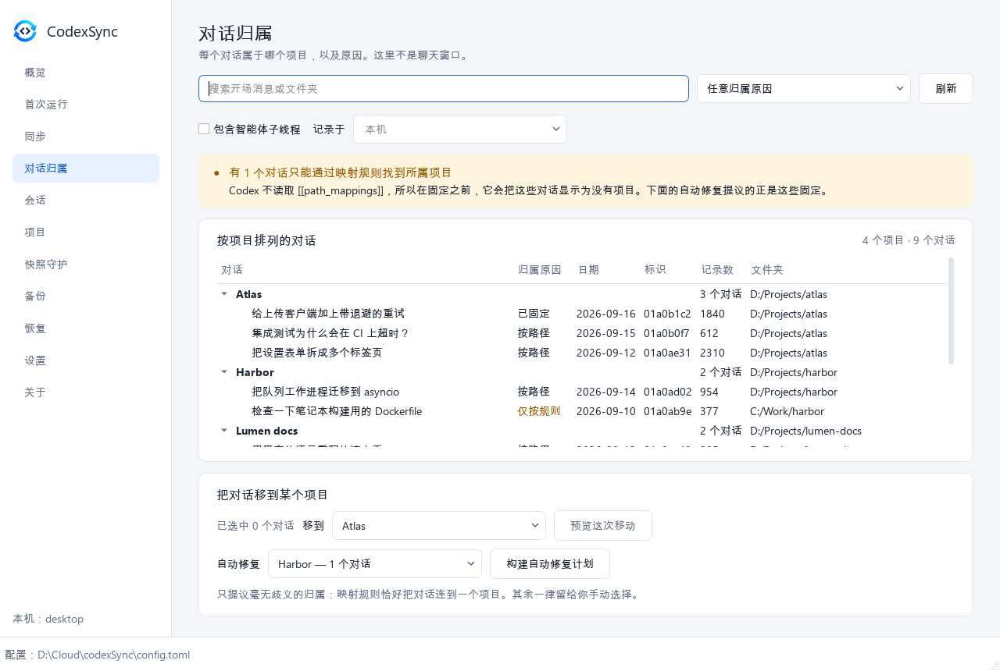
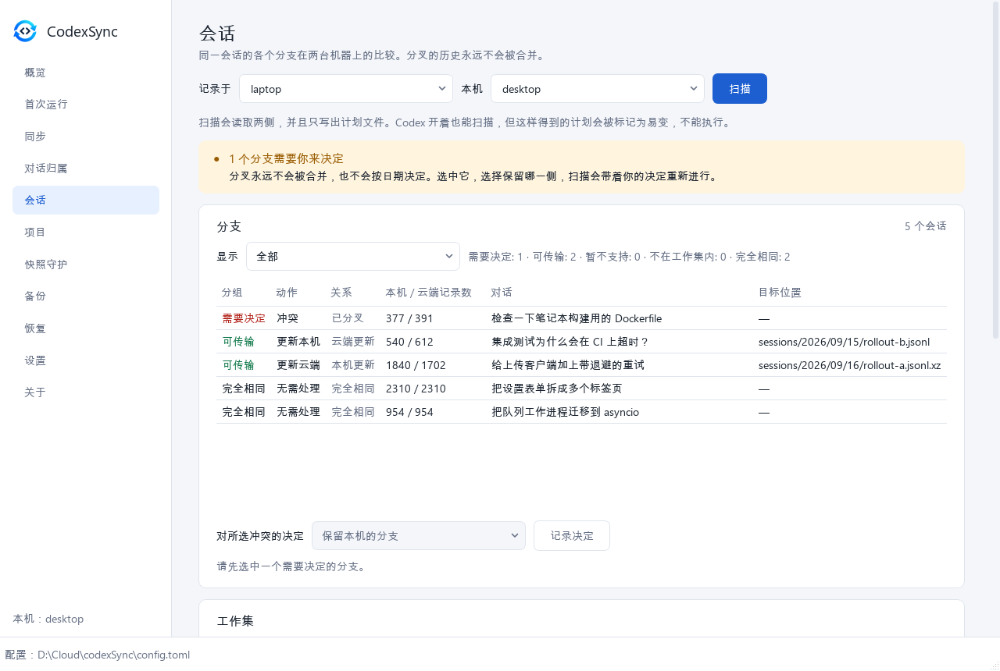
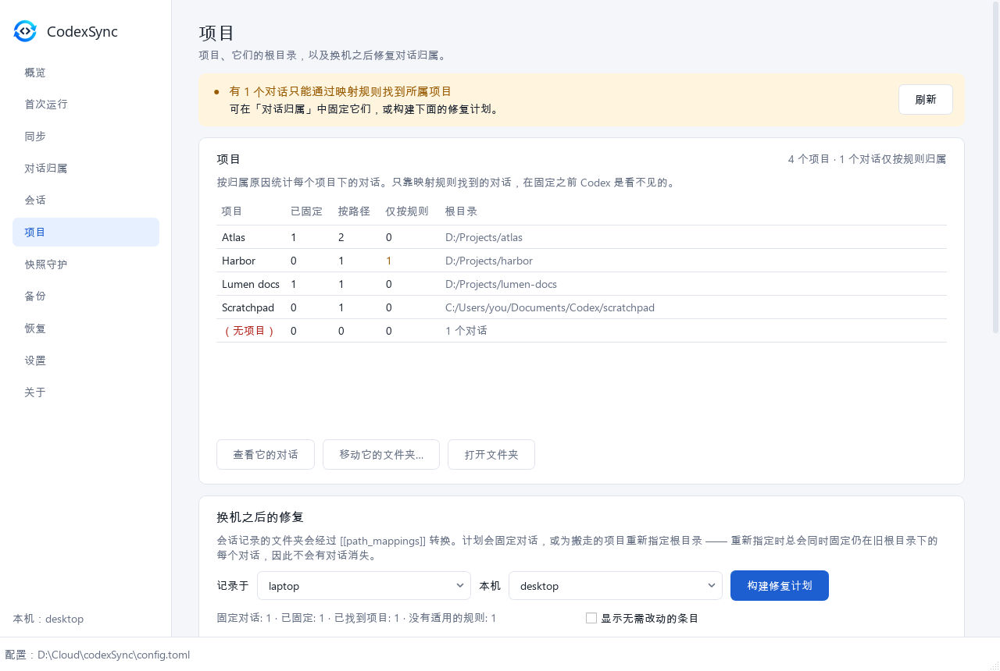
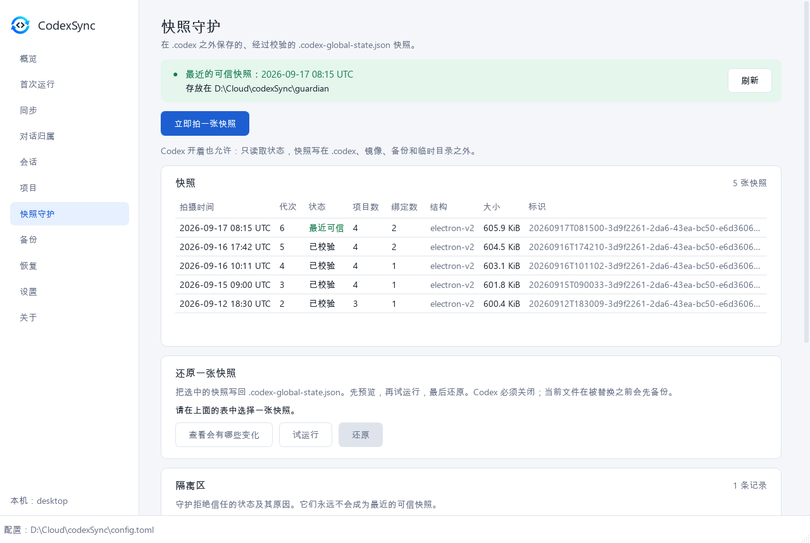
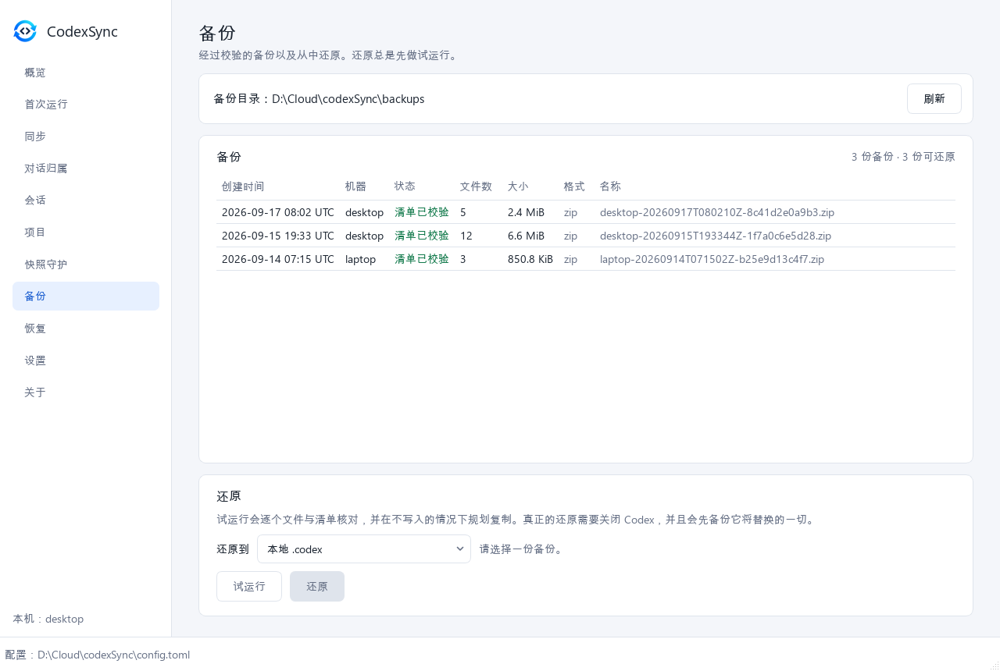
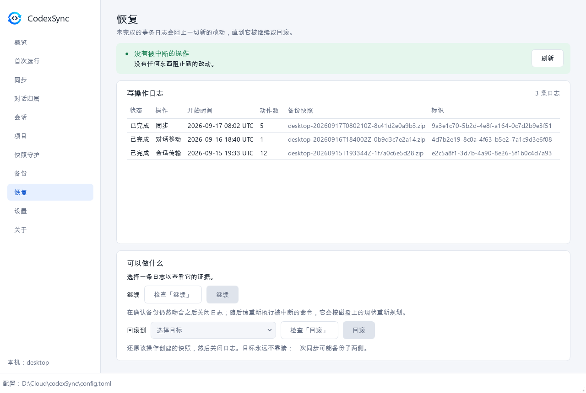
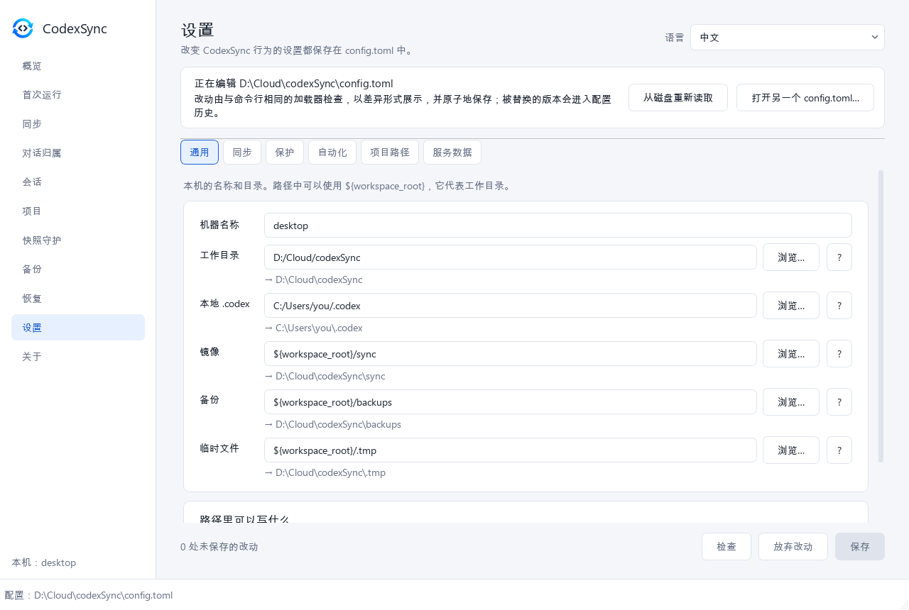
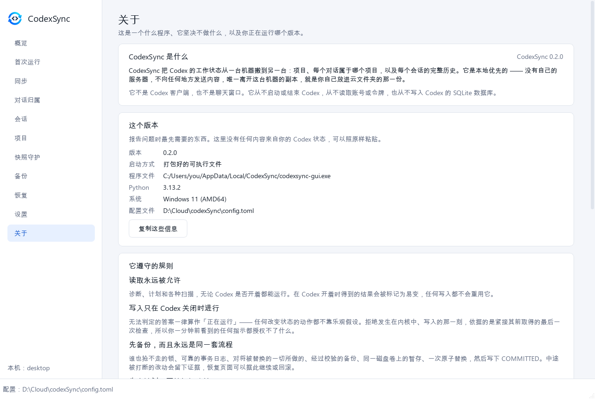

# 窗口

[English](../en/GUI.md) · [Русский](../ru/GUI.md) · **中文**

[← 文档](README.md)

窗口是覆盖在同一个内核之上的第二层外壳，和命令行一样：命令行做不到的事它也做不到，
并且遵守同样的规则。它提供英文、俄文和中文，以及浅色和深色两种主题。

- [启动](#启动)
- [安全](#安全)
- 界面：[概览](#概览) · [首次运行](#首次运行) · [同步](#同步) ·
  [对话归属](#对话归属) · [会话](#会话) · [项目](#项目) ·
  [快照守护](#快照守护) · [备份](#备份) · [恢复](#恢复) · [设置](#设置) ·
  [关于](#关于)
- [Windows exe](#windows-exe)

截图里是虚构的演示数据。它们由 `python scripts/docs_screenshots.py` 在没有窗口的情况下
绘制，而这个脚本从不读取真实的 `.codex`。

## 启动

```powershell
pip install ".[gui]"
codexsync-gui                      # 打开上次用过的配置
codexsync-gui -c config.toml       # 或者：python -m codexsync.gui -c config.toml
```

不带 `-c` 时，窗口会打开上次用过的配置；找不到时，则依次尝试当前文件夹、可执行文件旁边，
以及每用户位置下的 `config.toml`。如果一个都没有，它会停在「首次运行」页面。

底部状态栏始终显示当前打开的是哪个 `config.toml`，侧边栏显示本机的名称。

## 安全

窗口不会改变任何安全规则。

- **每一次写入都走与命令行相同的内核** —— 进程关卡、锁、事务日志、经过校验的备份和
  最后一次进程检查 —— 并在那里被拒绝，无论按钮看上去是什么样子。有一个测试通过读取
  窗口的 import 来证明它够不到这一层以下的任何东西。
- **「Codex 很可能已关闭」只是提示**，并且它自己也这么说。真正算数的检查是在写入的那
  一刻重新做的。
- **先出计划，再确认。** 每次改动都从计划或试运行开始；确认对话框会引用准确的计划标识。
  还原、继续和回滚只有在对同一选择做过试运行之后才会解锁。
- 耗时较长的只读扫描会在状态栏显示进度，并且可以在那里放弃等待；写入则不行。
- 窗口执行的计划保存在 `<workspace>/plans/` 下。

## 概览


对这台机器的一次手动检查；它不授权任何写入。横幅说明 Codex 看起来是否已关闭。表格就是
`doctor` 的报告：配置、状态目录、Codex 进程、检测到的全局状态结构、最近一张可还原的快照、
会话文件、会话索引、SQLite 线程目录、一次同步被允许做什么、项目存放在哪里，以及同步清单。
下方是同步的试运行，以及计划任务的状态和通往它设置的链接。

## 首次运行



用 CodexSync 内置的模板创建 `config.toml`，并保留每一条注释：

- **配置文件** —— 写到哪里；它不能位于 `.codex` 之内。
- **机器名称** —— 唯一且长期不变：备份、快照以及另一台机器上的映射规则都靠它来指认。
- **本地 .codex** —— Codex 自己的状态目录。它会被读取，只有在冷操作时才被写入；永远
  不会被创建。
- **同步的工作目录** —— 由云客户端在机器之间同步的文件夹。备份、快照、计划和日志都放在
  它下面。
- **会话镜像** —— 会话文件镜像到哪里；留空表示 `${workspace_root}/sync`。

当工作目录里已经有同名机器的数据时，这个页面会发出警告；它还会找出 codexSync 之前创建
过的工作目录，并且不在 `.codex` 里创建任何东西。你也可以从这里打开一个已有的
`config.toml`。

## 同步



云端 → 本地与本地 → 云端的计划。

- **检查计划**不写入任何内容，Codex 开着也能用。
- **试运行**和**同步**需要 Codex 关闭。同步会在写入的那一刻重新构建计划，所以屏幕上的
  内容永远不是直接被执行的东西。
- 搜索、方向和文件夹筛选只改变这里显示的内容：同步执行的始终是整份计划。
- 两侧都被改过的文件会列为冲突，并由 [`conflict.policy`](SYNC.md#冲突) 决定。

见[同步](SYNC.md)。

## 对话归属



每个对话属于哪个项目，以及原因。这里不是聊天窗口：它显示对话的开场消息、日期、标识、
记录数和文件夹，按项目分组。

**归属原因**说明一个对话为什么在它的项目下面：

| 原因 | 含义 |
|---|---|
| 已固定 | 有一条明确的绑定。项目路径变了它也跟着走。 |
| 按路径 | 对话的文件夹落在项目根目录之下。项目一搬走，它就被留在原地。 |
| 仅按规则 | 只有某条 `[[path_mappings]]` 规则把这个对话连到项目上。Codex 不读这些规则，所以在固定之前它会把这个对话显示为没有项目。 |

搜索覆盖开场消息和文件夹；你可以按原因筛选、把智能体子线程包含进来，也可以查看记录在
另一台机器上的对话。

**把对话移到某个项目** —— 选中对话，选择项目并预览这次移动；写入需要 Codex 关闭，还需要
预览给出的计划标识。**自动修复**只提议毫无歧义的固定：映射规则恰好把对话连到一个项目。

见[项目与对话](PROJECTS.md#对话)。

## 会话



同一会话的各个分支在两台机器上的比较。先选择这些会话记录在哪台机器上、本机又是哪一台，
然后**扫描**。扫描会读取两侧，并且只写出计划文件；在 Codex 开着时做出的计划会被标记为
易变，不能执行。

每个分支都会显示它的分组（需要决定、可传输、暂不支持、不在工作集内、完全相同）、动作、
关系（「云端更新」「本机更新」「已分叉」……）、两侧各自的记录数、对话和目标位置。

- **分叉永远不会被合并，也不会按日期解决。** 选中它，选择保留哪一侧，然后**记录决定**；
  扫描会带着这个决定重新进行。
- **工作集**把写入 `.codex` 的范围收窄到选定的项目和对话。云端镜像始终接收全部会话。
- **会话索引**显示两侧的 `session_index.jsonl` 各有什么。
- 先试运行，再按准确的计划标识执行。

见[会话](SESSIONS.md)。

## 项目



各个项目、它们的根目录，以及按原因统计的对话数（已固定、按路径、仅按规则），外加不属于
任何项目的对话。选中一个项目，可以**查看它的对话**、**移动它的文件夹**或**打开文件夹**。

- **移动它的文件夹…** 会把项目复制到一个新文件夹，逐个文件校验，只有到那时才让 Codex
  指向新的根目录。旧文件夹永远不会被修改或删除。
- **换机之后的修复**把会话记录的文件夹经过 `[[path_mappings]]` 转换，并构建一份计划：
  固定对话，或者为搬走的项目重新指定根目录。重新指定时总会同时固定仍在旧根目录下的
  每个对话，因此不会有对话消失。先试运行，再按标识执行。

见[项目与对话](PROJECTS.md)。

## 快照守护



在 `.codex` 之外保存的、经过校验的 `.codex-global-state.json` 快照。

- 横幅显示最近的可信快照，以及快照存放在哪里。
- **立即拍一张快照**在 Codex 开着时也允许：状态只会被读取。
- **快照**列出每一张快照及其代次、状态、项目数与绑定数、结构和大小。
- **还原一张快照** —— 选中一张，*查看会有哪些变化*、*试运行*，然后*还原*。Codex 必须
  关闭；当前文件会先备份。
- **隔离区**列出守护拒绝信任的状态及其原因。它们永远不会成为最近的可信快照。
- 当项目或绑定确实发生减少、以致 `latest-good` 停滞不前时，会出现**把当前状态接受为新的
  基准**；它只用数字来解释这次减少。

见[快照守护](GUARDIAN.md)。

## 备份



备份目录里的各份备份，以及是哪台机器做的、它们的清单能否校验通过、文件数、大小和格式。
**还原** —— 选择一份备份和一个目标（本地 `.codex` 或云端镜像），先跑试运行，它会逐个文件
与清单核对；真正的还原只有在那之后才解锁，需要 Codex 关闭，并且会先备份它将替换的一切。

见[备份与恢复](RECOVERY.md)。

## 恢复



每一次写入都会保留一份事务日志。未完成的日志会阻止一切新的改动，直到它被继续或回滚 ——
这道阻塞正是保护本身。

- **写操作日志** —— 状态、操作、开始时间、动作数量、备份快照和标识。
- **继续**会在确认备份仍然吻合之后关闭日志；随后请重新执行被中断的命令，它会按磁盘上的
  现状重新规划。
- **回滚到**会还原该操作创建的快照，然后关闭日志。目标永远不靠猜：一次同步可能备份了
  两侧。

每个动作都有自己的检查（试运行），必须先通过。

见[备份与恢复](RECOVERY.md#被中断的写操作)。

## 设置



**设置就是 `config.toml`。** 文件会被读入一份草稿；在你保存之前，什么都不会写入。

| 标签页 | 内容 |
|---|---|
| 通用 | 机器名称和各个目录。每个路径都会显示它最终解析成什么；`${workspace_root}` 代表工作目录。 |
| 同步 | 比较方式、冲突策略、方向、删除、包含哪些内容（从一棵目录树中勾选）以及排除哪些内容。 |
| 保护 | 进程检测与守护。`safety.*` 会显示出来，但永远不可编辑。 |
| 自动化 | 计划任务：它的作业、间隔和登录后启动；已安装的任务是否与配置一致、上次和下次运行时间，以及上次退出码的含义。 |
| 项目路径 | `[[path_mappings]]` 规则，用表单来填写。 |
| 服务数据 | 备份、会话镜像、同步清单、日志，以及配置历史。 |

保存只会改写发生变化的值并保留每一条注释，由与命令行相同的加载器校验，会展示差异；
如果文件自打开以来在磁盘上被改动过，保存会被拒绝；被替换的版本会留在
`<workspace>/config-history/` 下。保存之后已打开的计划都会被丢弃。被规则禁止的设置会
连同原因一起显示。

**来自旧版本的配置**会在这个界面顶部被点名出来：0.1 的模板设置了两个本版本
对任何写入都会拒绝的值，因此这样的文件会挡住 `sync`、`restore` 和一切修复，直到它被
升级为止。这张卡片会列出将要改什么、为什么改，显示确切差异，并以一次确认过的写入
全部应用，同时保留你的注释，并把被替换的文件复制到 `config-history/`。可选的发现
可以用旁边的勾选框保持原样。参见
[配置 → 升级来自旧版本的配置](CONFIGURATION.md#升级来自旧版本的配置)。

语言切换在页面顶部。窗口本身只记住它的大小、最后打开的页面、语言，以及上次打开的是哪个
配置 —— 永远不记 `config.toml` 的内容。

**自动化**只能执行安全作业 —— 守护快照、`preflight` 或同步试运行 —— 永远不会写入。见
[配置 → 自动化](CONFIGURATION.md#自动化)。

## 关于



这是一个什么程序、任何写入都遵守的四条规则、它有意留给你的部分，以及**这个版本** ——
版本号、是打包好的可执行文件还是源码检出、程序文件、Python、系统和当前使用的配置文件。
「复制这些信息」会把这些行放进剪贴板，便于报告问题；它们没有任何一条来自你的 Codex 状态，
可以照原样粘贴。

许可区块写明 GPL-3.0-or-later 和另有的商业许可，并说明内核与命令行没有任何第三方依赖，
而这个窗口通过 PySide6 使用 Qt，遵循 LGPL-3.0。那些链接会在浏览器中打开：窗口当前语言的
文档、项目主页、更新日志和问题跟踪。

## Windows exe

`codexsync-gui.exe` 既是窗口，也是命令行：给它一条命令
（`codexsync-gui.exe -c config.toml validate`），它就会在不弹出控制台的情况下执行那条命令，
已安装版本的计划任务跑的正是这个。只带控制台、不含 Qt 的 `codexsync.exe` 另行发布。

两者如何构建，写在[发布清单](../dev/PUBLISHING.md#c-windows-exe)里（英文）。
